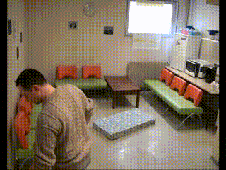

# Simple Fall Detection
<!-- Github Repo [here](https://github.com/jamesyoung-15/FallDetection). Quick proto-type project that aims to detect in real-time whether a person is falling, sitting, standing, or walking using only a camera image input. -->

My internship project/mini-prototype at [Intelligent Design Technology Limited](https://intelligentdesign.hk/english/) that aims to detect in real-time whether a person is falling, sitting, standing, or walking using only a camera image input. Demo below uses Yolo V8 Pose with heuristics to determine fall.

<p align="middle">
    
    
    
</p>

## About
This project has two implementations. The first implementatnion uses pose detection, where it uses pose estimation to extract a person's skeleton and uses heuristics (ie. angle between certain body parts) to determine a person's action. The second implementation uses an image classification to determine the person's state in each frame.

Full documentation [here](./docs/Documentation.md).

## Usage
### Clone Repo
```bash
git clone https://github.com/jamesyoung-15/FallDetection
cd FallDetection
```

### Install Dependencies
- Make sure to have Python 3 and Pip.
- Installing Ultralytics should install all required packages. 
- (Optional) Make and activate Python virtual environment

``` bash
python -m venv venv
source venv/bin/activate
```

- Install requirements:

``` bash
pip install ultralytics
```

### Example Run w/ Pose Approach
-  Yolo Pose Estimate on Video
```bash
python pose_fall_demo.py --src test/data/videos/fall-1.mp4 --interval 5 --pose_type 0
```

-  Movenet Pose Estimate on USB-Camera
```bash
python pose_fall_demo.py --src /dev/video0 --interval 7 --width 480 --height 320 --pose_type 1
```

- To see what options can be passed in user args, use `--help`
```bash
python pose_fall_demo.py --help
```

## Documentation
For full documentation see [here.](./docs/Documentation.md)
### Possible Approaches to Fall Detection/Action Detection
1. Use pose estimation w/ heuristics

2. Video classification

3. Image Classification

4. Combine some of the above methods (eg. pose estimate + classification).

In the end I could only implement 1 and 3. 

## Resources
- [Yolo Pose](https://docs.ultralytics.com/tasks/pose/)
- [Tensorflow Lite Pose Tutorial](https://www.tensorflow.org/lite/tutorials/pose_classification)
- [Movenet Example](https://github.com/Kazuhito00/MoveNet-Python-Example/tree/main)
- [Example of using Pose to determine posture](https://bozliu.medium.com/dynamic-siting-posture-recognition-and-correction-68ae418fbc77)
- [Ambianic Fall Detection with Pose and heuristics](https://blog.ambianic.ai/2021/03/25/fall-detection.html)